# 🤖 AI Email Intelligence & Routing

Sistema inteligente de **triagem, classificação e roteamento de e-mails** utilizando **n8n, LLMs, análise de sentimentos e automação de processos**.

O sistema recebe e-mails automaticamente, analisa seu conteúdo com Inteligência Artificial, identifica a **urgência**, classifica o tipo de solicitação e determina o **sentimento** da mensagem.

Após o processamento, o atendimento é direcionado automaticamente para o canal correspondente no **Slack**, os dados são estruturados e registrados em uma planilha. Um segundo workflow realiza a consolidação periódica das informações e envia um relatório para o gestor.

---

## 📌 Problema

Equipes corporativas podem receber diariamente uma grande quantidade de e-mails contendo diferentes tipos de solicitações:

- 🐛 Relatos de bugs
- ⭐ Elogios
- 😡 Reclamações
- 💡 Sugestões
- 🚨 Solicitações urgentes
- 📩 Solicitações gerais

A triagem manual desses e-mails pode consumir tempo, gerar inconsistências e dificultar a identificação rápida de demandas prioritárias.

Além disso, gestores precisam consolidar essas informações para acompanhar o volume e o perfil dos atendimentos.

---

## 🎯 Solução

O projeto automatiza o processo de análise e organização dos e-mails.

O sistema:

1. 📩 Recebe um novo e-mail
2. 🧠 Analisa o conteúdo utilizando LLM
3. 🚨 Identifica o nível de urgência
4. 🏷️ Classifica o tipo de solicitação
5. 😊 Analisa o sentimento
6. 🔀 Direciona o atendimento para o canal correspondente no Slack
7. 📊 Estrutura e registra os dados
8. 📋 Armazena as informações em uma planilha
9. ⏰ Executa um segundo workflow em horário programado
10. 📈 Consolida os dados
11. 📧 Envia um relatório periódico para o gestor

---

📸 Demonstração
### Workflow de Triagem
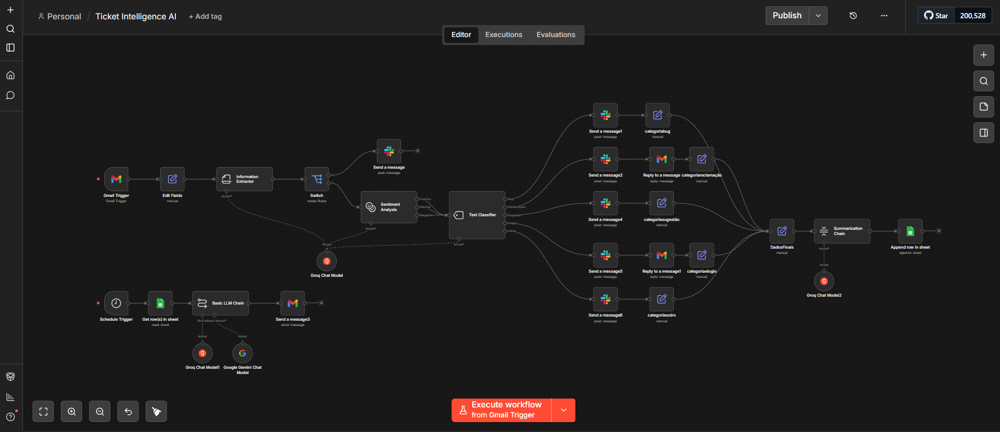

### Organização no Slack
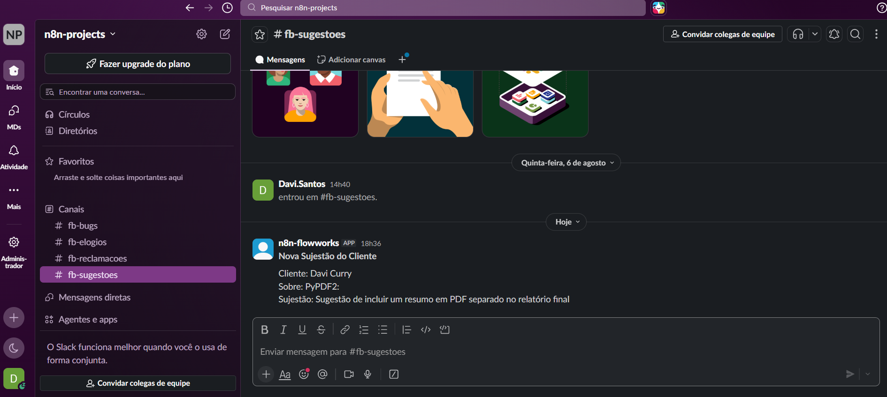
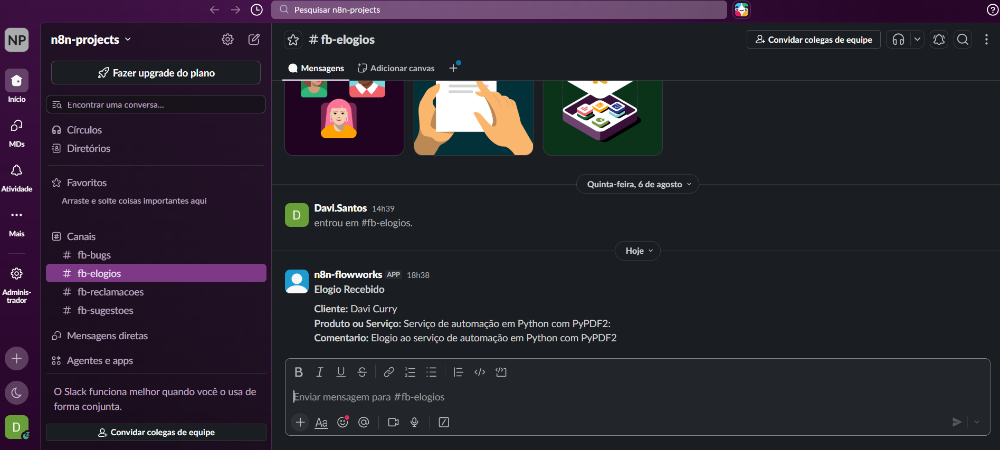

### Emails de Teste
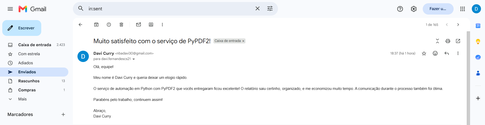
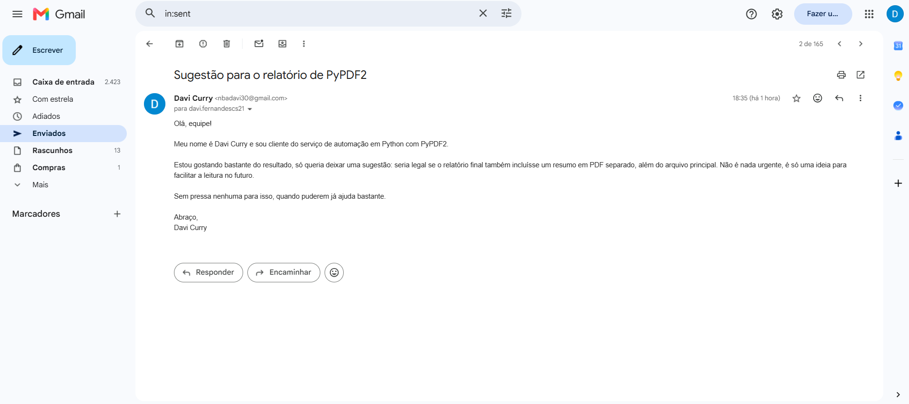

### Emails Respondidos
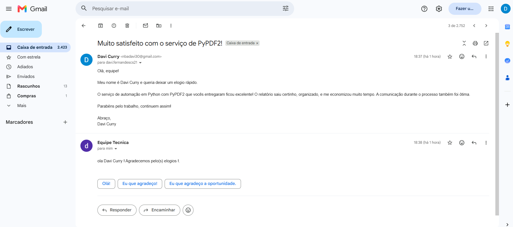

### Workflow de Relatório
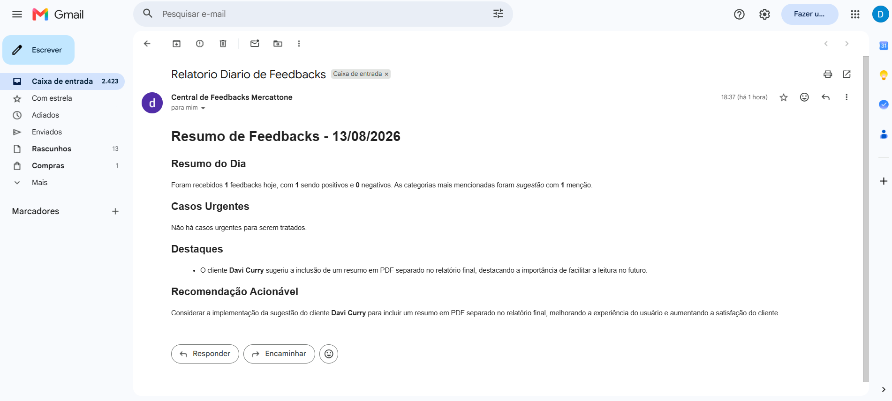
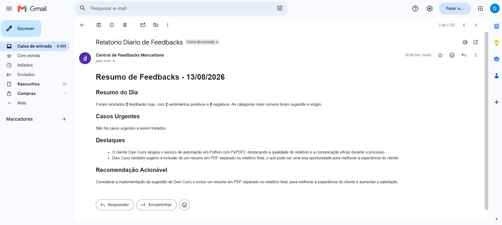

### Google Sheets (Planilha)
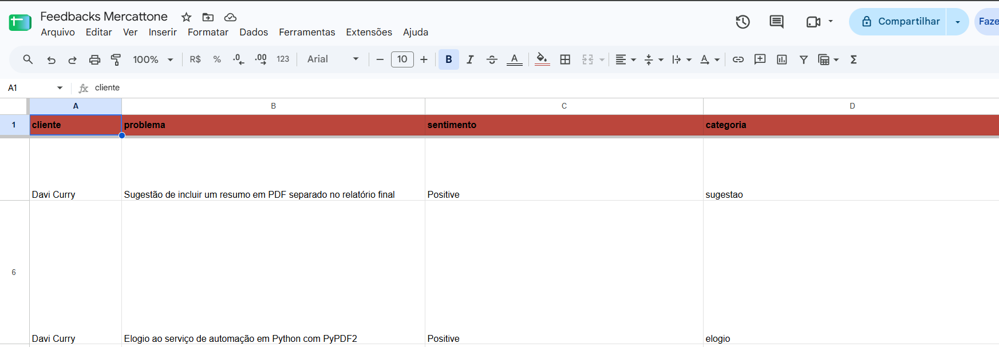
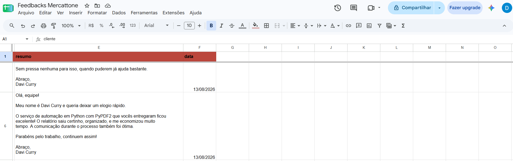

### Fluxo Funcionando(.Gif)
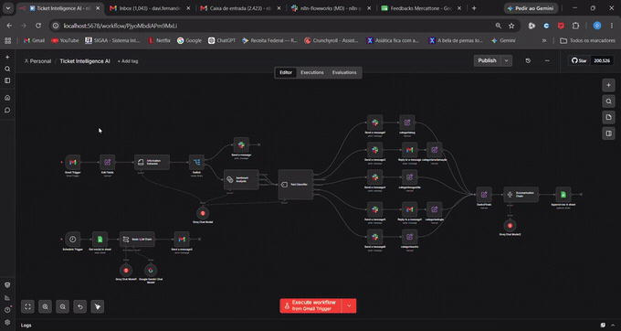

---

## 🧠 Inteligência Artificial

A IA é utilizada para interpretar o conteúdo dos e-mails e gerar informações estruturadas para o processo de automação.

### 🏷️ Classificação

Cada atendimento é classificado em uma das categorias:

- 🐛 **Bug**
- ⭐ **Elogio**
- 😡 **Reclamação**
- 💡 **Sugestão**

### 😊 Análise de Sentimento

O sistema identifica o sentimento predominante da mensagem:

- 🟢 **Positivo**
- ⚪ **Neutro**
- 🔴 **Negativo**

### 🚨 Análise de Urgência

O sistema também identifica a urgência da solicitação, permitindo priorizar demandas que necessitam de atenção mais rápida.

---

## 🏗️ Arquitetura

```text
                         📩 E-MAIL
                            │
                            ▼
                    ┌───────────────┐
                    │      n8n      │
                    │    Trigger    │
                    └───────┬───────┘
                            │
                            ▼
                    ┌───────────────┐
                    │      LLM      │
                    │    Análise    │
                    └───────┬───────┘
                            │
              ┌─────────────┼─────────────┐
              ▼             ▼             ▼
          🚨 Urgência    🏷️ Classe    😊 Sentimento
              │             │             │
              └─────────────┼─────────────┘
                            │
                            ▼
                    🔀 Roteamento
                            │
          ┌─────────────────┼─────────────────┐
          ▼                 ▼                 ▼
       🐛 Bug            ⭐ Elogio        😡 Reclamação
          │                 │                 │
          └─────────────────┼─────────────────┘
                            │
                            ▼
                         💬 Slack
                            │
                            ▼
                     📊 Google Sheets
                            │
                            ▼
                  ⏰ Workflow Agendado
                            │
                            ▼
                    📈 Consolidação
                            │
                            ▼
                     📧 Gestor

---

## Workflow 1 — Triagem Inteligente

O primeiro workflow processa cada e-mail recebido.

1. Recepção

O sistema identifica automaticamente um novo e-mail.

2. Extração

As informações relevantes da mensagem são preparadas para processamento.

3. Análise com LLM

O conteúdo é analisado por um modelo de linguagem para identificar contexto, intenção, urgência e sentimento.

4. Classificação

O sistema determina:

Categoria
Urgência
Sentimento
5. Roteamento

O n8n utiliza os resultados da análise para direcionar automaticamente a mensagem para o canal adequado no Slack.

6. Registro

Os dados processados são organizados e armazenados em uma planilha.

---

## ⏰ Workflow 2 — Relatório Gerencial

Um segundo workflow é executado automaticamente em um horário definido.

O processo:

Consulta os registros armazenados
Consolida os atendimentos
Analisa os dados
Gera um resumo gerencial
Envia o relatório para o gestor

Dessa forma, informações provenientes de diversos e-mails são transformadas em uma visão consolidada da operação.

💬 Roteamento no Slack

Os atendimentos são direcionados de acordo com a classificação realizada pela IA.

🐛 Bug
    ↓
#fb-bugs


⭐ Elogio
    ↓
#fb-elogios


😡 Reclamação
    ↓
#fb-reclamacoes


💡 Sugestão
    ↓
#fb-sugestoes

Esse processo reduz a necessidade de triagem manual e mantém os atendimentos organizados por contexto.

---

## 📊 Dados Estruturados

O sistema pode registrar informações como:

Campo	Descrição
Data	Data de recebimento do e-mail
Remetente	E-mail do solicitante
Assunto	Assunto da mensagem
Categoria	Bug, elogio, reclamação ou sugestão
Urgência	Nível de prioridade identificado
Sentimento	Positivo, neutro ou negativo
Conteúdo	Mensagem processada
Canal	Canal de destino no Slack

---

## 📈 Benefícios
⚡ Redução do trabalho manual
🤖 Automação da triagem
🎯 Classificação consistente
🚨 Identificação de solicitações urgentes
😊 Análise automática de sentimentos
💬 Organização dos atendimentos no Slack
📊 Centralização dos dados
📈 Visibilidade gerencial
⏰ Geração automática de relatórios
🔄 Processamento contínuo

---

## 🛠️ Tecnologias
n8n — Orquestração e automação dos workflows
LLMs — Classificação e análise semântica
Groq — Execução de modelos de linguagem
Google Sheets — Armazenamento estruturado
Slack — Comunicação e roteamento dos atendimentos
Gmail — Recepção e processamento dos e-mails
Workflow Automation — Execução baseada em eventos e horários

---

## 🎓 Objetivo do Projeto

Este projeto foi desenvolvido como demonstração prática de aplicação de Inteligência Artificial Generativa, automação de processos e integração entre serviços.

O projeto explora conceitos de:

Automação de processos
Inteligência Artificial Generativa
Large Language Models
Processamento de linguagem natural
Classificação de dados
Análise de sentimentos
Integração entre APIs
Orquestração de workflows
Automação empresarial
Análise e consolidação de dados

---

## 👨‍💻 Autor

Davi Santos

Ciência da Computação — UFS

Python | IA Generativa | Automação | n8n | Ciência de Dados | SQL